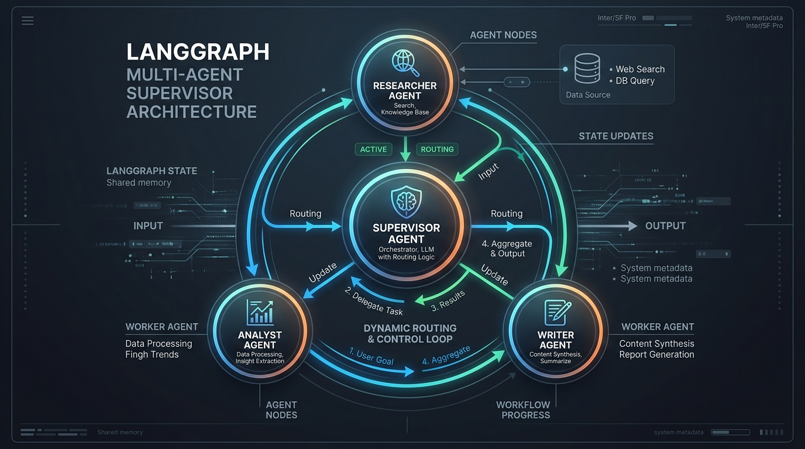

# 🚀 LangGraph Multi-Agent Systems & Supervisor Orchestration Guide

A comprehensive guide and reference implementation for building advanced **Multi-Agent Orchestration Systems** in LangGraph. This repository showcases a supervisor-worker architecture where a centralized orchestrator dynamically delegates tasks to specialized workers (**Researcher**, **Analyst**, and **Writer**) to collaborate on complex objectives.

---

## 📐 Multi-Agent Supervisor Architecture Diagram

Below is the dynamic routing and state transition loop for the Supervisor architecture:



---

## 📂 Project Structure

```text
langgraph/
├── assets/
│   └── supervisor_multiagent_architecture.jpg # Architecture Diagram
├── multiagents/
│   └── multiaiagent.ipynb                     # Multi-Agent Interactive Notebook
├── .env                                       # API Keys & Tracing Configuration (Private)
├── .env.example                               # Environment Variables Template
├── pyproject.toml                             # Project Dependencies & UV Config
└── requirements.txt                           # Dependency List
```

---

## 🧠 Core Architecture Concepts

### 1. Shared Graph State (`SupervisorState`)
Unlike simple pipelines, LangGraph agents coordinate by reading from and writing to a shared, thread-safe memory called the state. The [SupervisorState](multiagents/multiaiagent.ipynb#L314) extends `MessagesState` to track execution history along with specific context fields:

```python
from langgraph.graph import MessagesState

class SupervisorState(MessagesState):
    """State for the supervisor multi-ai-agent system"""
    next_agent: str        # Tells the router which node to execute next
    research_data: str     # Stores raw data gathered by the Researcher
    analysis: str          # Stores insights extracted by the Analyst
    final_report: str      # Stores the compiled document from the Writer
    task_complete: bool    # Boolean flag indicating the end of the graph execution
    current_task: str      # The overarching query or objective being solved
```

### 2. The Supervisor Node (Orchestrator)
The supervisor is an LLM-powered orchestrator that acts as a router. It evaluates the current state (e.g., whether research or analysis has been performed) and decides which agent should work next:

- **State Evaluation:** Evaluates boolean flags such as `has_research`, `has_analysis`, and `has_report`.
- **Decision Logic:** Emits the name of the next agent (e.g., `researcher`, `analyst`, `writer`) or `"DONE"` when the goal is achieved.

### 3. Specialized Workers
- **Researcher Agent:** Gathers raw information based on the `current_task` using tools (like Web Search). Saves findings to `research_data` and yields control back to the supervisor.
- **Analyst Agent:** Reads `research_data`, extracts patterns, opportunities, and strategic insights, saves them to `analysis`, and yields control back to the supervisor.
- **Writer Agent:** Combines `research_data` and `analysis` to generate a publication-ready Executive Report. Saves the output to `final_report` and marks `task_complete = True`.

---

## 🧱 Code Walkthrough

### 1. Supervisor Agent Node
The supervisor uses a custom prompt template to ensure it outputs strictly one of the target node strings:

```python
def create_supervisor_chain():
    supervisor_prompt = ChatPromptTemplate.from_messages([
        ("system", """You are a supervisor managing a team of agents:
          1. Researcher - Gathers information and data
          2. Analyst - Analyzes data and provides insights
          3. Writer - Creates reports and summaries

          Based on the current state and conversation, decide which agent should work next.
          If the task is complete, respond with 'DONE'.

          Current State:
          - Has research data: {has_research}
          - Has analysis: {has_analysis}
          - Has report: {has_report}

          Respond with ONLY the agent name (researcher/analyst/writer) or 'DONE'.
        """),
        ("human", "{task}")
    ])
    return supervisor_prompt | llm
```

### 2. Router & Conditional Edges
A central [router](multiagents/multiaiagent.ipynb#L549) function reads the state and directs execution. If the supervisor selects `"end"` or `task_complete` is `True`, it returns the terminal node `END`:

```python
def router(state: SupervisorState) -> Literal["supervisor", "researcher", "analyst", "writer", "__end__"]:
    next_agent = state.get("next_agent", "supervisor")
    
    if next_agent == "end" or state.get("task_complete", False):
        return END
        
    return next_agent
```

---

## 🚀 Graph Execution & Initialization

### ⚠️ Common Pitfall: Empty State Invocation
If you invoke the graph with an empty dictionary or omit the `"messages"` list:
```python
# ❌ THIS WILL IMMEDIATELY FINISH AND OUTPUT 'No task'
response = graph.invoke({})
```
Since the `messages` list is empty, the supervisor defaults the task to `"No task"`. The LLM naturally decides `"DONE"`, immediately terminating the graph.

### ✅ Correct Invocation Pattern
You must initialize the graph with the task inside the `messages` list as a `HumanMessage` and initialize the helper state variables:

```python
from langchain_core.messages import HumanMessage

response = graph.invoke({
    "messages": [
        HumanMessage(content="Analyze the benefits and risks of AI in healthcare.")
    ],
    "current_task": "Analyze the benefits and risks of AI in healthcare.",
    "research_data": "",
    "analysis": "",
    "final_report": "",
    "next_agent": "supervisor",
    "task_complete": False
})

print(response["final_report"])
```

---

## 🛠️ Setup & Requirements

1. **Clone and Configure Environment:**
   Create a `.env` file in the root directory:
   ```env
   GROQ_API_KEY="your-groq-key"
   TAVILY_API_KEY="your-tavily-key"
   LANGSMITH_API_KEY="your-langsmith-key" # Optional for tracing
   ```

2. **Dependencies:**
   Ensure dependencies are installed via `pip` or `uv`:
   ```bash
   pip install langgraph langchain-groq langchain-tavily python-dotenv
   ```
