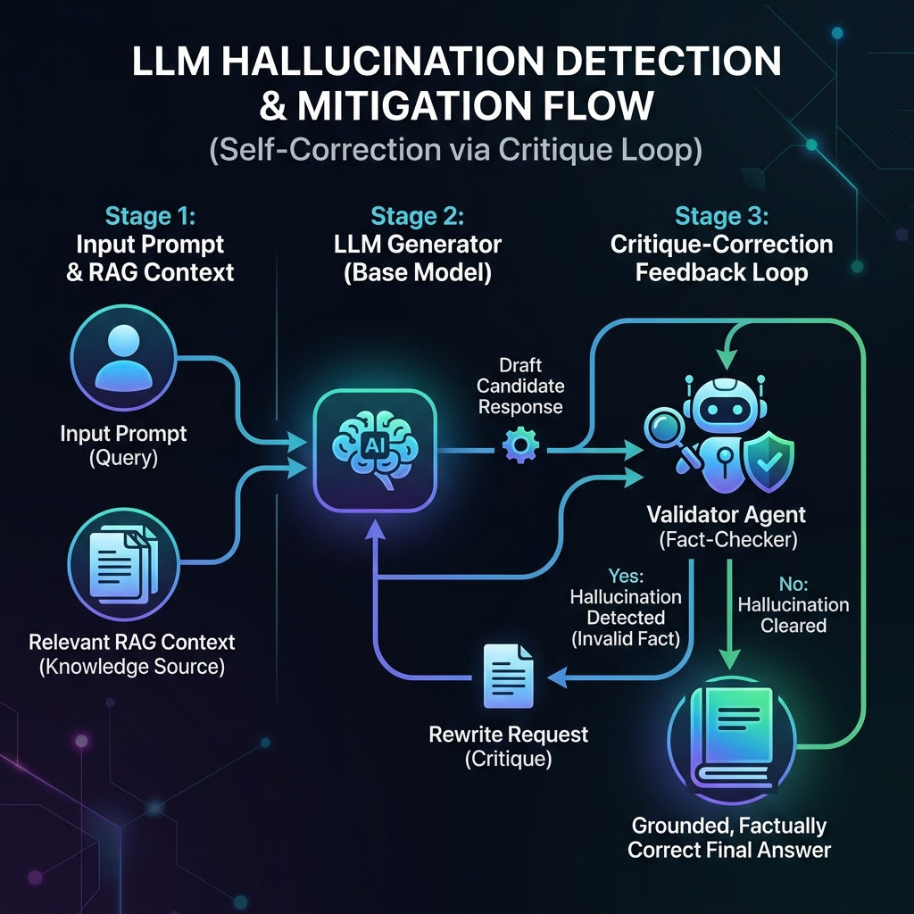

# 🧠 LangGraph & Pydantic Master Class Roadmap

Welcome to the **LangGraph & Pydantic Learning Roadmap**! This repository serves as a step-by-step master class and reference workspace for building stateful, multi-agent AI systems, implementing standard communication protocols (MCP), tracing workflows, and handling multimodal RAG pipelines.

Each topic is structured as a standalone chapter situated in its own branch. This `main` branch acts as the landing page and index.

---

## 🗺️ Learning Roadmap Index

| Chapter | Topic | Remote Git Branch | Primary Code / Workspace |
| :--- | :--- | :--- | :--- |
| **Chapter 1** | [🧬 Pydantic Validation & Schemas](#-chapter-1-pydantic-validation--schemas) | [`pydantic`](https://github.com/nbnitishbharti2/langgraph/tree/pydantic) | [`pydantic/pydantic.ipynb`](pydantic/pydantic.ipynb) |
| **Chapter 2** | [🕸️ LangGraph Basics](#-chapter-2-langgraph-basics) | [`langchain-basics`](https://github.com/nbnitishbharti2/langgraph/tree/langchain-basics) | [`langgraph-basics/simple-graph.ipynb`](langgraph-basics/simple-graph.ipynb) |
| **Chapter 3** | [🤖 LangGraph Chatbot with Multiple Tools](#-chapter-3-langgraph-chatbot-with-multiple-tools) | [`langgraph-tools`](https://github.com/nbnitishbharti2/langgraph/tree/langgraph-tools) | [`langgraph-tools/chatbotmultipletools.ipynb`](langgraph-tools/chatbotmultipletools.ipynb) |
| **Chapter 4** | [🔌 Model Context Protocol (MCP) & Control](#-chapter-4-model-context-protocol-mcp--agent-control) | [`mcp`](https://github.com/nbnitishbharti2/langgraph/tree/mcp) | [`mcp/`](mcp/) |
| **Chapter 5** | [🔍 Observability, Debugging & Monitoring](#-chapter-5-observability-debugging--monitoring) | [`debugging-monitoring`](https://github.com/nbnitishbharti2/langgraph/tree/debugging-monitoring) | [`debugging/`](debugging/) |
| **Chapter 6** | [👥 Multi-Agent Orchestrations & Supervisor](#-chapter-6-multi-agent-orchestrations--supervisor) | [`multiagents`](https://github.com/nbnitishbharti2/langgraph/tree/multiagents) | [`multiagents/multiaiagent.ipynb`](multiagents/multiaiagent.ipynb) |
| **Chapter 7** | [🖼️ Multimodal Retrieval-Augmented Generation](#-chapter-7-multimodal-retrieval-augmented-generation-rag) | [`multimodal`](https://github.com/nbnitishbharti2/langgraph/tree/multimodal) | [`multimodal-rag/`](multimodal-rag/) |
| **Chapter 8** | [🛡️ LLM Hallucination Mitigation](#-chapter-8-llm-hallucination-mitigation) | [`llm-hallucination`](https://github.com/nbnitishbharti2/langgraph/tree/llm-hallucination) | [`hallucination/llm-hallucination.ipynb`](hallucination/llm-hallucination.ipynb) |

---

## 🧬 Chapter 1: Pydantic Validation & Schemas
* **Git Branch**: [`pydantic`](https://github.com/nbnitishbharti2/langgraph/tree/pydantic)
* **Code References**: [`pydantic/pydantic.ipynb`](pydantic/pydantic.ipynb)

Before building agent graphs, it is essential to define strict data schemas for inputs, outputs, and intermediate states. This chapter explores **Pydantic (v2)**, Python's most popular data validation and serialization library.

### Core Concepts Covered
* **Runtime Verification**: Contrasting Pydantic's `BaseModel` (which forces runtime validation and raises `ValidationError`) against Python's standard `@dataclass` (which ignores type hints during execution).
* **Optional Fields & Type Coercion**: Handling optional inputs with default parameters and understanding how Pydantic automatically coerces similar data types (e.g. converting numeric strings to floats).
* **Collection Validation**: Enforcing list rules (e.g. `List[str]`), where invalid elements trigger validation errors.
* **Nested Schemas**: Creating deep data configurations by nesting models inside other models (e.g., `Address` model nested within a `Customer` model).
* **Field Decorators (`Field`)**: Customizing schemas with metadata constraints (min/max numeric ranges, string length boundaries, explanations, and dynamic default factories like current timestamps).

---

## 🕸️ Chapter 2: LangGraph Basics
* **Git Branch**: [`langchain-basics`](https://github.com/nbnitishbharti2/langgraph/tree/langchain-basics)
* **Code References**: [`langgraph-basics/simple-graph.ipynb`](langgraph-basics/simple-graph.ipynb)

This chapter introduces the basics of **LangGraph**, a framework for building stateful, multi-actor applications with Large Language Models.

### Core Concepts Covered
* **State Graph Schema (`State`)**: Defining graph state structures using `TypedDict` from python's typing module to store variables that flow through nodes.
* **Nodes**: Creating functional node components that accept the current state as a parameter, perform operations, and return dictionary updates to be merged back into the state.
* **Edges**: Implementing static edges (`START` and `END`) to build fixed node pipelines.
* **Dynamic Conditional Routing**: Creating routing functions that return target node literals to dynamically redirect graph pathways based on state values.
* **Compilation & Visualization**: Using `.compile()` to create executable graphs and rendering structural diagrams via Mermaid (`draw_mermaid_png()`).

---

## 🤖 Chapter 3: LangGraph Chatbot with Multiple Tools
* **Git Branch**: [`langgraph-tools`](https://github.com/nbnitishbharti2/langgraph/tree/langgraph-tools)
* **Code References**: [`langgraph-tools/chatbotmultipletools.ipynb`](langgraph-tools/chatbotmultipletools.ipynb)

An agent's utility is expanded when it can invoke external tools to solve real-world problems. This chapter implements a stateful chatbot equipped with multi-tool capabilities.

### Core Concepts Covered
* **Message Reduction (`add_messages`)**: Using state reducers to append new messages instead of overwriting existing ones, preserving complete conversational contexts.
* **Tool Bindings**: Utilizing Groq models via `ChatGroq` and binding API utility functions (such as ArXiv search, Wikipedia lookup, and Tavily real-time web engines) to the LLM.
* **ReAct Agent Design**: Configuring the agent in a **Reason + Act** feedback loop where the LLM decides to invoke tools, and a feedback edge passes the results back to the LLM for iterative reasoning.
* **Prebuilt Graphs**: Using prebuilt utilities like `ToolNode` and `tools_condition` to automate routing.

### 📐 ReAct Architecture & Chatbot Workflow


---

## 🔌 Chapter 4: Model Context Protocol (MCP) & Agent Control
* **Git Branch**: [`mcp`](https://github.com/nbnitishbharti2/langgraph/tree/mcp)
* **Code References**: [`mcp/basicchatbot.ipynb`](mcp/basicchatbot.ipynb), [`mcp/humanintheloop.ipynb`](mcp/humanintheloop.ipynb), [`mcp/mcp-client/client.py`](mcp/mcp-client/client.py), [`mcp/mcp-tools/mathserver.py`](mcp/mcp-tools/mathserver.py), [`mcp/mcp-tools/weather.py`](mcp/mcp-tools/weather.py)

This chapter focuses on state preservation (Memory), granular graph streaming, Human-in-the-loop control, and standardized tool integrations using the open **Model Context Protocol (MCP)**.

### Core Concepts Covered
* **Memory Checkpointing**: Using `MemorySaver` to capture state snapshots keyed by isolated `thread_id` parameters to support multi-turn chatbot conversation sessions.
* **Granular Response Streaming**: Utilizing `.stream()` to emit complete states (`values`), incremental changes (`updates`), or raw tokens (`astream_events`).
* **Human-in-the-Loop (HITL)**: Implementing breakpoints that pause execution using `interrupt` to request human confirmation for actions, and resuming them using `Command(resume=...)`.
* **Model Context Protocol (MCP)**: Building standalone tool services with `FastMCP` (providing math calculations and async weather search) and wrapping them for the agent using `MultiServerMCPClient`.
* **Transport Layers**: Decoupling servers and clients using local standard input/output pipes (`stdio`) or Server-Sent Events (`sse`) HTTP protocols.

### 📐 State, Streaming, and Protocol Diagrams


---

## 🔍 Chapter 5: Observability, Debugging & Monitoring
* **Git Branch**: [`debugging-monitoring`](https://github.com/nbnitishbharti2/langgraph/tree/debugging-monitoring)
* **Code References**: [`debugging/agent.py`](debugging/agent.py), [`debugging/debugging.ipynb`](debugging/debugging.ipynb), [`debugging/langgraph.json`](debugging/langgraph.json)

Moving agents from development to production requires deep tracing and debugging tools. This chapter covers telemetry setup and interactive GUI debugging.

### Core Concepts Covered
* **LangSmith Telemetry**: Connecting graphs to LangSmith using environment variables (`LANGSMITH_TRACING="true"`) to log execution timelines, costs, and token usages.
* **Workspace Isolation**: Allocating logs to designated project containers using tracing variable buckets (`LANGSMITH_PROJECT` and `LANGCHAIN_PROJECT`).
* **LangGraph Studio Dev Server**: Generating a configuration manifest [`langgraph.json`](debugging/langgraph.json) and serving graphs locally via `langgraph dev` for visual testing.
* **Windows Console Optimization**: Configuring UTF-8 encoding variables (`$env:PYTHONIOENCODING="utf-8"`) to avoid Unicode crashes on Windows shells.

### 📐 Telemetry Architecture


---

## 👥 Chapter 6: Multi-Agent Orchestrations & Supervisor
* **Git Branch**: [`multiagents`](https://github.com/nbnitishbharti2/langgraph/tree/multiagents)
* **Code References**: [`multiagents/multiaiagent.ipynb`](multiagents/multiaiagent.ipynb)

For complex tasks, a single agent can become overloaded. This chapter demonstrates the **Supervisor-Worker** design pattern to coordinate multiple specialized agents.

### Core Concepts Covered
* **Shared Multi-Agent State (`SupervisorState`)**: Expanding basic dictionary state models to track researcher reports, analyst takeaways, writer drafts, and completion flags.
* **The Supervisor Node**: Creating a centralized LLM orchestrator that acts as a router, reviewing state variables, and selecting which agent executes next.
* **Specialized Collaborators**:
    * **Researcher**: Focuses on web query scraping and populates raw logs.
    * **Analyst**: Examines gathered research logs and isolates key insights.
    * **Writer**: Consolidates summaries and compiles executive reports.
* **Common Pitfalls**: Resolving immediately terminating empty-state graphs by properly initializing variables during invocation.

### 📐 Supervisor Multi-Agent Design


---

## 🖼️ Chapter 7: Multimodal Retrieval-Augmented Generation (RAG)
* **Git Branch**: [`multimodal`](https://github.com/nbnitishbharti2/langgraph/tree/multimodal)
* **Code References**: [`multimodal-rag/multimodalopenai.ipynb`](multimodal-rag/multimodalopenai.ipynb), [`multimodal-rag/multimodal_sample.pdf`](multimodal-rag/multimodal_sample.pdf)

Traditional RAG pipelines struggle when documents contain critical information in charts, images, and visual elements. This chapter builds a multimodal ingestion and search pipeline.

### Core Concepts Covered
* **Document Extraction**: Parsing complex multi-page PDFs using PyMuPDF to extract text paragraphs and export image arrays.
* **Unified Embedding Spaces**: Utilizing OpenAI's **CLIP** model (`clip-vit-base-patch32`) to project both image arrays and text chunks into the exact same high-dimensional coordinate space.
* **FAISS Search Index**: Indexing pre-computed CLIP vectors in FAISS to support simultaneous text-to-text and text-to-image similarity searches.
* **Multimodal Generation**: Converting retrieved images to base64 strings and passing them alongside relevant text chunks to GPT-4 Vision for grounded visual reasoning.

### 📐 Ingestion and Verification Flows


---

## 🛡️ Chapter 8: LLM Hallucination Mitigation
* **Git Branch**: [`llm-hallucination`](https://github.com/nbnitishbharti2/langgraph/tree/llm-hallucination)
* **Code References**: [`hallucination/llm-hallucination.ipynb`](hallucination/llm-hallucination.ipynb)

LLMs generate fluent language based on probability distributions, which can lead to plausible-sounding but completely fictitious claims (hallucinations). This chapter covers why hallucinations happen and how to programmatically mitigate them.

### Core Concepts Covered
* **Technical Root Causes**: Next-token prediction probabilities, compressed parametric memory retrieval, exposure bias propagation, sycophantic alignment, and attention span window issues ("lost in the middle").
* **RAG Grounding**: Overriding parametric memory by injecting verified facts directly into the prompt context.
* **Hyperparameter Controls**: Lowering `Temperature` (towards `0.0`) and restricting `Top-P` (Nucleus Sampling) to enforce deterministic and factual responses.
* **Advanced Prompt Constraints**: Integrating negative guardrails (e.g. *"If the answer is not in the text, reply 'I do not know'"*) and prompting Chain-of-Thought (CoT) reasoning steps.
* **Critique-Correction Feedback Loops**: Designing multi-agent validation graphs where a generator produces a candidate response, a validator verifies facts, and a writer updates drafts until they pass validation.

### 📐 Critique-Correction Mitigation Architecture



---

## 🚀 Environment Setup

1. **Clone the Repo & Create Environment**:
   ```bash
   git clone https://github.com/nbnitishbharti2/langgraph.git
   cd langgraph
   ```
2. **Install Dependencies**:
   ```bash
   uv pip install -r requirements.txt
   ```
3. **Configure API Credentials** (`.env`):
   ```env
   GROQ_API_KEY="your-groq-key"
   TAVILY_API_KEY="your-tavily-key"
   LANGSMITH_API_KEY="your-langsmith-key" # Optional for tracing
   OPENAI_API_KEY="your-openai-key"       # Required for Multimodal RAG
   ```