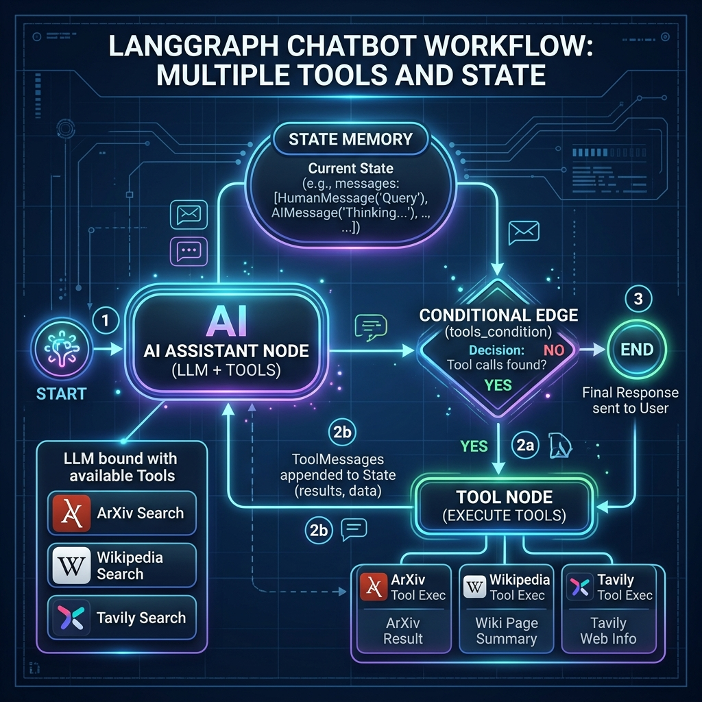

# LangGraph Chatbot with Multiple Tools

A stateful, tool-augmented conversational agent built using **LangGraph**, **LangChain**, and **ChatGroq**. This project demonstrates how an LLM dynamically decides when to invoke external tools (ArXiv, Wikipedia, Tavily Web Search) to answer complex or real-time user queries.

---

## 📐 Architecture & Workflow Diagram



---

## 📓 Source Notebook

The full implementation and step-by-step code execution can be found in:  
👉 **[langgraph-tools/chatbotmultipletools.ipynb](file:///d:/PHP8.2/htdocs/learning/python-learning/langgraph/langgraph-tools/chatbotmultipletools.ipynb)**

---

## 🚀 Key Concepts Explained

### 1. State Management (`State` & `add_messages`)

In LangGraph, the graph state serves as the memory shared between all nodes.

```python
from typing import Annotated
from langchain_core.messages import AnyMessage
from langgraph.graph.message import add_messages
from typing_extensions import TypedDict


class State(TypedDict):
  messages: Annotated[list[AnyMessage], add_messages]
```

- **`TypedDict`**: Defines the state schema structure.
- **`add_messages` Reducer**: Specifies how new messages returned by nodes are handled. Instead of overwriting the `messages` list, `add_messages` appends new messages (or updates existing ones by `id`), maintaining full conversation context.

---

### 2. Multi-Tool Integration

The chatbot is equipped with three tools to fetch real-world data across different domains:

#### A. ArXiv Research Tool ([ArxivQueryRun](file:///d:/PHP8.2/htdocs/learning/python-learning/langgraph/langgraph-tools/chatbotmultipletools.ipynb#L65-L70))
Used to query academic preprints and research papers.
- **Compatibility Patch**: Resolves `AttributeError: 'Search' object has no attribute 'results'` caused by `arxiv>=2.0.0`.
```python
import arxiv
from langchain_community.tools import ArxivQueryRun
from langchain_community.utilities import ArxivAPIWrapper

# Compatibility patch for arxiv >= 2.0.0
if not hasattr(arxiv.Search, "results"):
  arxiv.Search.results = lambda self: arxiv.Client().results(self)

api_wrapper_arxiv = ArxivAPIWrapper(top_k_results=2, doc_content_chars_max=500)
arxiv_tool = ArxivQueryRun(
    api_wrapper=api_wrapper_arxiv, description="Query arxiv papers"
)
```

#### B. Wikipedia Knowledge Tool ([WikipediaQueryRun](file:///d:/PHP8.2/htdocs/learning/python-learning/langgraph/langgraph-tools/chatbotmultipletools.ipynb#L126-L133))
Used to query encyclopedic background knowledge.
- **User-Agent Fix**: Sets a custom `User-Agent` to prevent Wikimedia API from blocking requests with HTTP 403 / `JSONDecodeError`.
```python
from langchain_community.tools import WikipediaQueryRun
from langchain_community.utilities import WikipediaAPIWrapper
import wikipedia

wikipedia.set_user_agent(
    "Mozilla/5.0 (Windows NT 10.0; Win64; x64) AppleWebKit/537.36 (KHTML, like"
    " Gecko) Chrome/120.0.0.0 Safari/537.36"
)

api_wrapper_wiki = WikipediaAPIWrapper(
    top_k_results=2, doc_content_chars_max=500
)
wiki_tool = WikipediaQueryRun(
    api_wrapper=api_wrapper_wiki, description="Query wikipedia articles"
)
```

#### C. Tavily Real-Time Web Search Tool ([TavilySearchResults](file:///d:/PHP8.2/htdocs/learning/python-learning/langgraph/langgraph-tools/chatbotmultipletools.ipynb#L180-L184))
Used to query up-to-date real-time web information and news.
```python
from langchain_community.tools.tavily_search import TavilySearchResults

tavily_tool = TavilySearchResults()
tools = [arxiv_tool, wiki_tool, tavily_tool]
```

---

### 3. Binding Tools to LLM (`bind_tools`)

The LLM is initialized via **ChatGroq** (using `qwen/qwen3.6-27b`). We bind our tool definitions to the model using `.bind_tools()`.

```python
from langchain_groq import ChatGroq

llm = ChatGroq(model="qwen/qwen3.6-27b")
llm_with_tools = llm.bind_tools(tools=tools)
```

When user input requires external info, `llm_with_tools` outputs an `AIMessage` containing a `tool_calls` request instead of a standard text response.

---

### 4. Defining Nodes & Prebuilt Constructs

#### Agent Node (`tool_calling_llm`)
A custom node function that calls the LLM with the accumulated message history from `state`:

```python
def tool_calling_llm(state: State):
  return {"messages": [llm_with_tools.invoke(state["messages"])]}
```

#### Tool Node (`ToolNode`)
Uses LangGraph's prebuilt `ToolNode(tools)` component, which automatically detects tool call requests, executes the corresponding tool function (ArXiv, Wikipedia, or Tavily), and appends the result as a `ToolMessage`.

---

### 5. Graph Assembly & Conditional Edges

```python
from langgraph.graph import END, START, StateGraph
from langgraph.prebuilt import ToolNode, tools_condition

builder = StateGraph(State)

# Add Nodes
builder.add_node("tool_calling_llm", tool_calling_llm)
builder.add_node("tools", ToolNode(tools))

# Schedule Edges
builder.add_edge(START, "tool_calling_llm")
builder.add_conditional_edges("tool_calling_llm", tools_condition)
builder.add_edge("tools", END)

# Compile Graph
graph = builder.compile()
```

- **`tools_condition` Router**: A prebuilt conditional edge function.
  - If the last message from `tool_calling_llm` contains a `tool_calls` request $\rightarrow$ routes execution to `"tools"`.
  - If no tool call was requested $\rightarrow$ routes execution directly to `END`.

---

### 6. Executing the Chatbot & Displaying Output

Pass user queries as initial messages to `graph.invoke()`, and inspect formatted output using `.pretty_print()`:

```python
messages = graph.invoke({"messages": "What is today's ai news?"})
for m in messages["messages"]:
  m.pretty_print()
```

---

## 🛠️ Environment Configuration

Ensure your API keys are defined in a `.env` file at the root of the project:

```env
GROQ_API_KEY=your_groq_api_key
TAVILY_API_KEY=your_tavily_api_key
```

And loaded via `python-dotenv`:

```python
from dotenv import load_dotenv

load_dotenv()
```