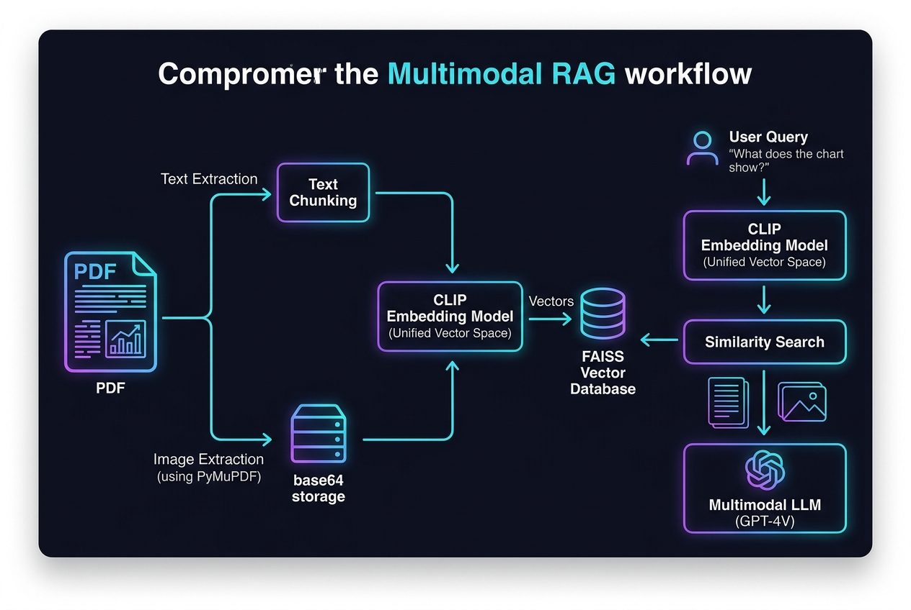

# 📚 Multimodal Retrieval-Augmented Generation (RAG) Guide

A complete educational implementation and reference guide for building a **Multimodal Retrieval-Augmented Generation (RAG)** pipeline. This system processes complex PDF documents containing both text and visual diagrams, generates unified embeddings for both modalities using OpenAI's CLIP model, indexes them in a unified FAISS vector database, and uses a Multimodal Large Language Model (GPT-4 Vision) to answer user questions using both textual and visual context.

The codebase is centered around the interactive Jupyter notebook [multimodalopenai.ipynb](multimodal-rag/multimodalopenai.ipynb).

---

## 📐 Multimodal RAG System Architecture Diagram

Below is the step-by-step workflow of the multimodal ingestion, indexing, retrieval, and generation process:



---

## 📂 Project Structure

```text
langgraph/
├── assets/
│   └── multimodal_rag_flow.jpg               # Workflow Infographic
├── multimodal-rag/
│   ├── multimodalopenai.ipynb                # Interactive Notebook & Source Implementation
│   └── multimodal_sample.pdf                 # Sample Multi-page PDF containing charts & text
├── .env                                      # API Keys & Environment configuration (Private)
├── .env.example                              # Environment Variables Template
├── pyproject.toml                            # Project Configuration & Dependency definitions
└── requirements.txt                          # Python Package List
```

---

## 🧠 Core Concepts & Technical Workflow

Traditional RAG systems are limited to textual information. If a document contains critical data in charts, tables, diagrams, or images, it is lost during standard text chunking. Multimodal RAG bridges this gap using a **Unified Vector Space** approach:

### 1. Unified Multimodal Space (OpenAI CLIP)
Rather than having separate databases for text and images, this pipeline leverages **CLIP (Contrastive Language-Image Pre-training)**. CLIP is a joint image and text embedding model developed by OpenAI that embeds both text strings and images into the *same* high-dimensional vector space:
* Semantically similar images and text chunks map to nearby points in this vector space.
* For example, the vector representation of the text phrase *"Q3 Revenue Graph"* will be close to the vector representation of the actual image containing the Q3 revenue chart.
* This is implemented via:
  * [`embed_text`](multimodal-rag/multimodalopenai.ipynb#L164): Embeds text chunks, padding or truncating to CLIP's maximum limit of **77 tokens**.
  * [`embed_image`](multimodal-rag/multimodalopenai.ipynb#L147): Normalizes PIL Images and computes image feature vectors.

### 2. Document Processing & Ingestion (PyMuPDF)
We process the input PDF [multimodal_sample.pdf](multimodal-rag/multimodal_sample.pdf) using PyMuPDF to extract text and extract raw images:
* **Text Extraction**: Text is split into chunks of `500` characters (with `100` overlap) using `RecursiveCharacterTextSplitter`. Each chunk is embedded with [`embed_text`](multimodal-rag/multimodalopenai.ipynb#L164) and stored as a Document.
* **Image Extraction**: Images are extracted using PyMuPDF (`page.get_images()`), converted to PIL Images, and encoded as base64 strings to be stored in a local map (`image_data_store`). Each image is embedded with [`embed_image`](multimodal-rag/multimodalopenai.ipynb#L147) and stored as a Document containing metadata with the image ID reference.

### 3. Unified Indexing (FAISS)
A unified vector index is instantiated via `FAISS.from_embeddings()`. We bypass standard embedding functions during index instantiation because we supply our precomputed CLIP vectors directly:
```python
vector_store = FAISS.from_embeddings(
  text_embeddings=[(doc.page_content, emb) for doc, emb in zip(all_docs, embeddings_array)],
  embedding=None, # We use precomputed CLIP embeddings
  metadatas=[doc.metadata for doc in all_docs]
)
```

### 4. Multimodal Search & Retrieval
When a user asks a question, the pipeline:
1. Converts the query text into a CLIP embedding vector via [`embed_text`](multimodal-rag/multimodalopenai.ipynb#L164).
2. Performs a similarity search in the FAISS vector database via [`retrieve_multimodal`](multimodal-rag/multimodalopenai.ipynb#L650).
3. Retrieves a mixed list of the top $K$ relevant items, which can include both **text chunks** and **image pointers** (using metadata like `type: "image"`).

### 5. Multimodal Reasoning (GPT-4 Vision)
Before generating an answer, retrieved documents are compiled into a LangChain message via [`create_multimodal_message`](multimodal-rag/multimodalopenai.ipynb#L671):
* Text excerpts are concatenated as text fields.
* Image documents retrieve their corresponding base64 data from the local store and are appended as inline visual elements using data URIs (`data:image/png;base64,...`).
* The final compiled message is sent to GPT-4V (`openai:gpt-4.1`), which performs visual reasoning over the retrieved charts and context to generate a highly accurate, grounded answer.

---

## 🛠️ Setup & Execution

### 1. Configure the Environment
Ensure your `.env` file in the root directory contains your OpenAI API credentials:
```env
OPENAI_API_KEY="your-openai-api-key"
```

### 2. Install Dependencies
Dependencies are managed through `pyproject.toml` or `requirements.txt`. Install them using:
```bash
pip install -r requirements.txt
```
*Note: PyMuPDF requires binary bindings which are installed automatically with `pip install pymupdf`. CLIP model downloading requires PyTorch (`torch`) and HuggingFace Transformers (`transformers`).*

### 3. Running the Pipeline
Open the notebook [multimodalopenai.ipynb](multimodal-rag/multimodalopenai.ipynb) in your IDE or Jupyter interface and execute all cells sequentially:
* The notebook downloads CLIP (`openai/clip-vit-base-patch32`) locally.
* It parses the sample document [multimodal_sample.pdf](multimodal-rag/multimodal_sample.pdf).
* It builds the vector store, runs a test pipeline queries suite, and demonstrates retrieval logs showing exactly what pages and images were retrieved for the LLM.

---

## ⚠️ Important Considerations & Constraints

> [!IMPORTANT]
> **CLIP Context Window Limit**: CLIP's text encoder has a strict constraint limit of **77 tokens**. Any search query or text chunk longer than this will be truncated when computing embeddings. Keep search query prompts concise and text chunk sizes moderate.

> [!NOTE]
> **OpenAI API Quota & Billing**: GPT-4 Vision calls consume more tokens than standard text models due to image input pricing. If you encounter a `RateLimitError` or `insufficient_quota` (Error 429), verify that your OpenAI account is funded and has active credits.
