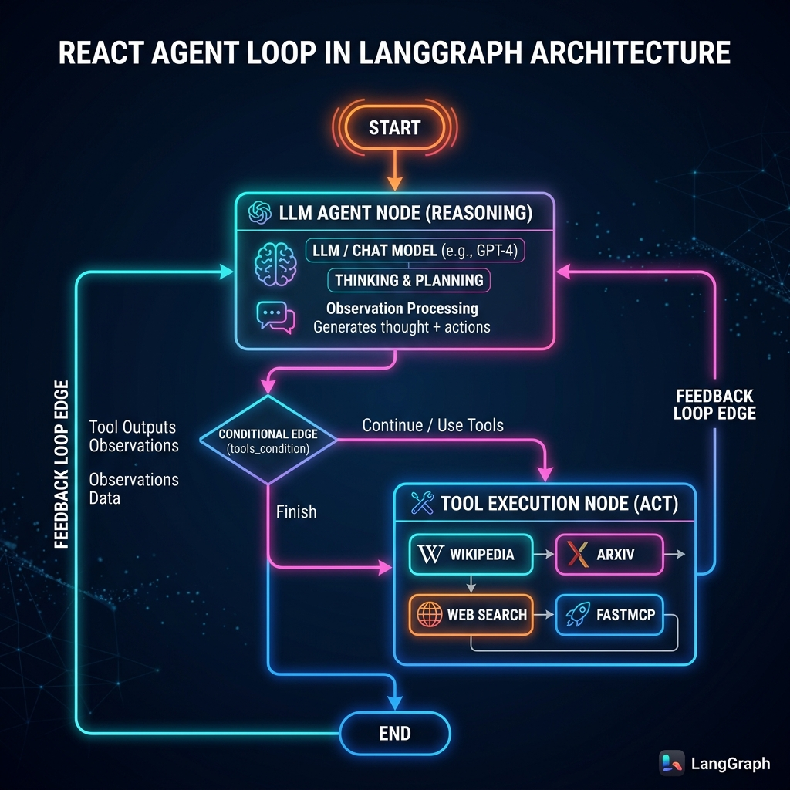
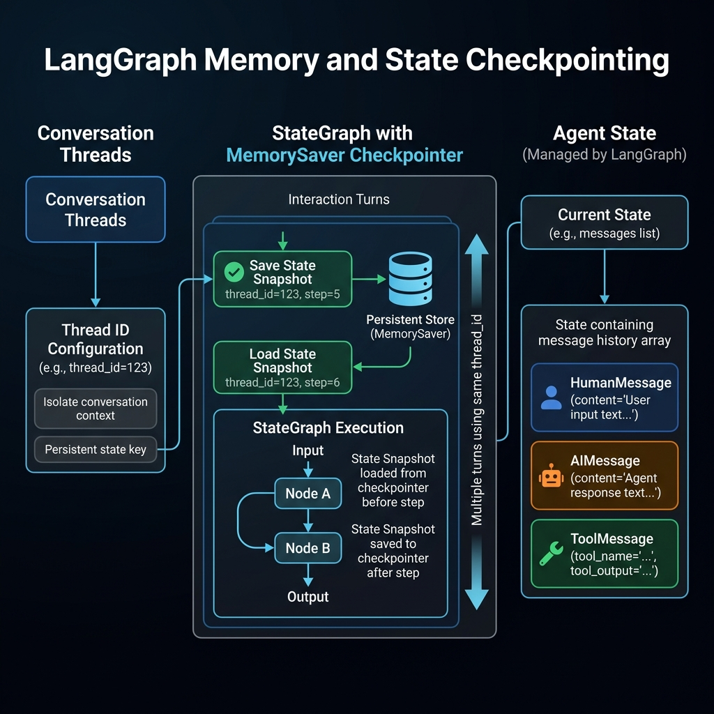
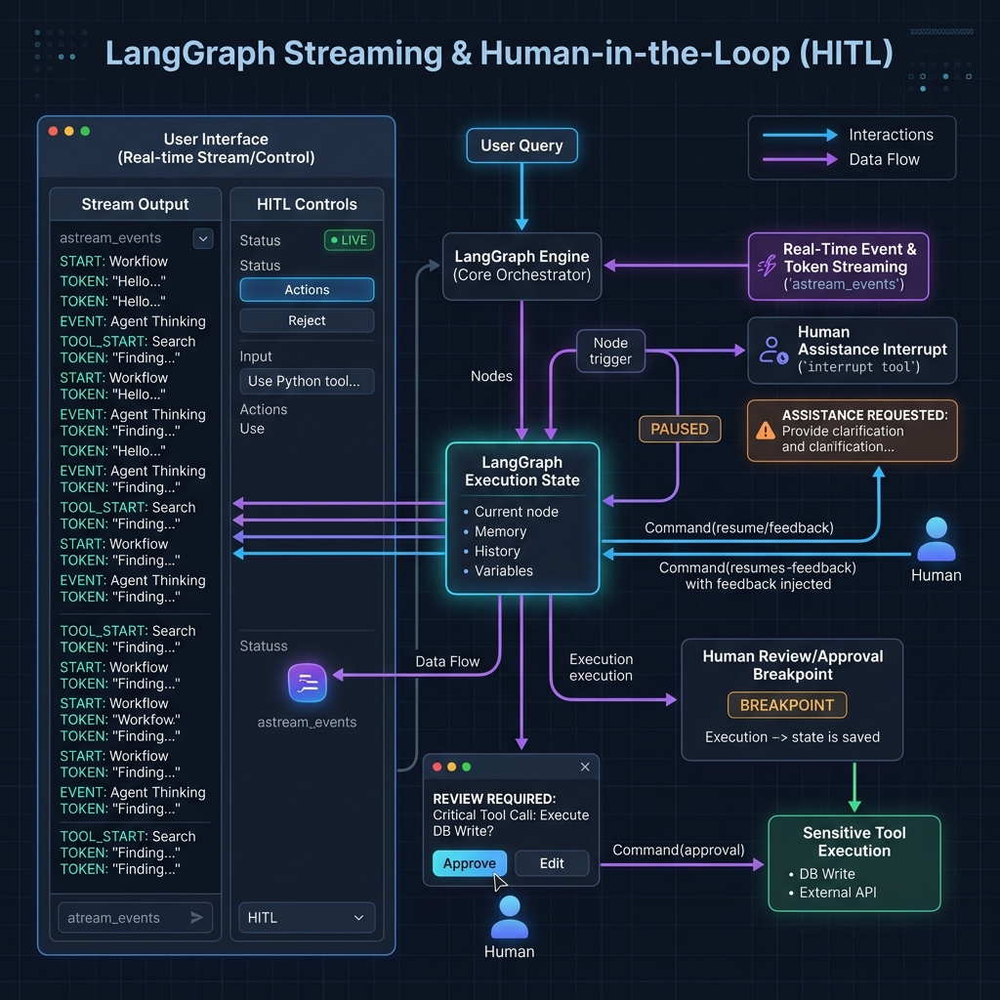

# 🚀 LangGraph & Model Context Protocol (MCP) Master Guide

A comprehensive guide and reference implementation for **LangGraph**, **LangChain**, and the **Model Context Protocol (MCP)**. This repository showcases stateful conversational agents, ReAct (Reason + Act) loop architectures, memory checkpointing, real-time streaming, Human-in-the-Loop (HITL) workflows, and multi-server MCP tool integration.

---

## 📂 Project Architecture & Folder Overview

### Directory Structure

```text
langgraph/
├── assets/                                 # Conceptual Architecture Diagrams
│   ├── mcp_architecture_diagram.png
│   ├── memory_state_architecture.png
│   ├── react_loop_architecture.png
│   └── streaming_hitl_architecture.png
├── mcp/                                    # MCP & LangGraph Core Modules
│   ├── mcp-tools/                          # FastMCP Tool Servers
│   │   ├── mathserver.py                   # Math MCP Server (stdio)
│   │   └── weather.py                      # Weather MCP Server (stdio / sse)
│   ├── mcp-client/                         # LangGraph MCP Client
│   │   └── client.py                       # MultiServerMCPClient & ReAct Agent
│   ├── basicchatbot.ipynb                  # ReAct, Memory Saver, & Streaming Notebook
│   ├── humanintheloop.ipynb                # Interrupt & Human Approval (HITL) Notebook
│   ├── mcpdemolangchain.ipynb              # LangChain MCP Integration Demo
│   └── README.md                           # Sub-system Documentation
├── pyproject.toml                          # Project Dependencies & Configuration
└── requirements.txt                        # Pip Requirements File
```

---

## 🧱 Block 1: ReAct (Reason + Act) Agent Architecture

The **ReAct (Reason + Act)** pattern enables the agent to dynamically determine when external tools are required, execute those tools, inspect results, and loop back iteratively until a final response is ready.

### 📐 ReAct Loop Architecture Diagram



### Key Architecture Components

1. **State Graph Schema (`State`)**: Shared state object carrying conversation history (`messages: Annotated[list, add_messages]`).
2. **LLM Node (`tool_calling_llm`)**: Invokes the LLM bound with available tools (`llm.bind_tools(tools)`).
3. **Conditional Router (`tools_condition`)**: 
   - Routes to `"tools"` if the assistant message contains `tool_calls`.
   - Routes to `END` if no tool calls are requested.
4. **Tool Execution Node (`ToolNode`)**: Executes requested tool functions and appends results as `ToolMessage`.
5. **Feedback Edge (`"tools"` $\rightarrow$ `"tool_calling_llm"`)**: Loops tool outputs back into the LLM node for multi-step reasoning.

### Code Implementation

```python
from langgraph.graph import END, START, StateGraph
from langgraph.graph.message import add_messages
from langgraph.prebuilt import ToolNode, tools_condition
from typing_extensions import TypedDict


class State(TypedDict):
  messages: Annotated[list, add_messages]


def tool_calling_llm(state: State):
  return {"messages": [llm_with_tools.invoke(state["messages"])]}


builder = StateGraph(State)
builder.add_node("tool_calling_llm", tool_calling_llm)
builder.add_node("tools", ToolNode(tools))

# Schedule Edges
builder.add_edge(START, "tool_calling_llm")
builder.add_conditional_edges("tool_calling_llm", tools_condition)
builder.add_edge("tools", "tool_calling_llm")  # ReAct Feedback Loop

graph = builder.compile()
```

---

## 🧱 Block 2: Memory & State Checkpointing (`MemorySaver`)

Without memory, stateful graphs reset after every execution. LangGraph provides checkpointer persistence engines (such as `MemorySaver`) to save state snapshots keyed by unique thread IDs.

### 📐 Memory & State Architecture Diagram



### Key Memory Concepts

- **Thread Isolation (`thread_id`)**: Every conversation session is isolated using `config={"configurable": {"thread_id": "1"}}`.
- **`add_messages` Reducer**: Appends new user/assistant/tool messages to the history list without overwriting prior turns.
- **State Checkpointing**: Automatically updates state checkpoints after every node transition, enabling multi-turn conversation memory.

### Code Implementation

```python
from langgraph.checkpoint.memory import MemorySaver

# Initialize Checkpointer
memory = MemorySaver()

# Compile Graph with Memory Checkpointer
graph = builder.compile(checkpointer=memory)

# Multi-Turn Conversation Execution
config = {"configurable": {"thread_id": "session_101"}}

# Turn 1: User introduces themselves
graph.invoke({"messages": "Hi, I am Nitish"}, config=config)

# Turn 2: Agent remembers name from checkpointer memory
response = graph.invoke({"messages": "What is my name?"}, config=config)
print(response["messages"][-1].content)  # Output: "Your name is Nitish."
```

---

## 🧱 Block 3: Real-Time Streaming & Human-in-the-Loop (HITL)

LangGraph provides native support for real-time response streaming and human interaction breakpoints (Human-in-the-Loop).

### 📐 Streaming & HITL Architecture Diagram



### Key Streaming & HITL Concepts

1. **Streaming Modes**:
   - `graph.stream(..., stream_mode="values")`: Emits complete state values after each step.
   - `graph.stream(..., stream_mode="updates")`: Emits incremental node state updates.
   - `graph.astream_events(...)`: Emits granular LLM tokens and tool start/end events.

2. **Human-in-the-Loop (`interrupt` & `Command`)**:
   - **Interrupting (`interrupt`)**: Pauses graph execution during a tool call to ask for human guidance or approval.
   - **Resuming (`Command(resume=...)`)**: Resumes graph execution from the exact paused node with human feedback data.

### HITL Code Implementation

👉 Notebook Reference: **[mcp/humanintheloop.ipynb](file:///d:/PHP8.2/htdocs/learning/python-learning/langgraph/mcp/humanintheloop.ipynb)**

```python
from langchain_core.tools import tool
from langgraph.types import Command, interrupt


@tool
def human_assistance(query: str) -> str:
  """Request human intervention/approval."""
  human_response = interrupt({"query": query})
  return human_response["data"]


# Execute graph until interrupt occurs
config = {"configurable": {"thread_id": "hitl_session"}}
events = graph.stream(
    {
        "messages": (
            "I need expert guidance for building an AI agent. Request"
            " assistance."
        )
    },
    config,
    stream_mode="values",
)

# Resume execution after human inputs response
human_reply = (
    "We recommend checking out LangGraph for building extensible agents."
)
resume_command = Command(resume={"data": human_reply})
events = graph.stream(resume_command, config, stream_mode="values")
```

---

## 🧱 Block 4: Model Context Protocol (MCP) Integration

The **Model Context Protocol (MCP)** is an open standard designed to decouple AI applications (clients) from tool & data providers (servers).

### 📐 MCP Architecture & Transport Diagram


### Core MCP Components

- **MCP Tool Servers**: Standalone server processes (built with `FastMCP`) exposing executable functions.
  - **[mathserver.py](file:///d:/PHP8.2/htdocs/learning/python-learning/langgraph/mcp/mcp-tools/mathserver.py)**: Exposes `add()`, `subtract()`, `multiply()`, `divide()`.
  - **[weather.py](file:///d:/PHP8.2/htdocs/learning/python-learning/langgraph/mcp/mcp-tools/weather.py)**: Exposes async `weather()` lookup.
- **MCP Client**: `MultiServerMCPClient` from `langchain-mcp-adapters` connects to servers, aggregates tools, and passes them to LangGraph's `create_react_agent`.

### MCP Client Code Implementation

👉 Script Reference: **[mcp/mcp-client/client.py](file:///d:/PHP8.2/htdocs/learning/python-learning/langgraph/mcp/mcp-client/client.py)**

```python
import asyncio
import os
import sys
from dotenv import load_dotenv
from langchain_groq import ChatGroq
from langchain_mcp_adapters.client import MultiServerMCPClient
from langgraph.prebuilt import create_react_agent

load_dotenv()

math_path = os.path.abspath(
    os.path.join(os.path.dirname(__file__), "mcp/mcp-tools/mathserver.py")
)
weather_path = os.path.abspath(
    os.path.join(os.path.dirname(__file__), "mcp/mcp-tools/weather.py")
)


async def main():
  # Connect to multiple MCP servers via stdio transport
  client = MultiServerMCPClient({
      "math": {
          "command": sys.executable,
          "args": [math_path],
          "transport": "stdio",
      },
      "weather": {
          "command": sys.executable,
          "args": [weather_path],
          "transport": "stdio",
      },
  })

  # Dynamically fetch MCP tools & create ReAct agent
  tools = await client.get_tools()
  model = ChatGroq(model="llama-3.3-70b-versatile")
  agent = create_react_agent(model, tools)

  # Invoke Agent
  res = await agent.ainvoke(
      {"messages": [{"role": "user", "content": "what is 2 + 2?"}]}
  )
  print("Response:", res["messages"][-1].content)


if __name__ == "__main__":
  asyncio.run(main())
```

---

## 🧱 Block 5: Transport Layer Architecture Deep-Dive

MCP supports multiple communication protocol layers for client-server interaction. The table below compares the primary transport options:

| Transport Layer | Mechanism | Network Exposure | Best Use Case | Performance & Overhead |
| :--- | :--- | :--- | :--- | :--- |
| **Standard I/O (`stdio`)** | Piped `stdin`/`stdout` child processes | Local host process only (Zero network exposure) | Local CLI tools, sandboxed Python scripts, desktop apps | High speed, lowest latency, zero network overhead |
| **Server-Sent Events (`sse`)** | HTTP GET (SSE stream) + HTTP POST (Tool calls) | Network accessible (HTTP/HTTPS) | Distributed microservices, cloud web services | Moderate latency, HTTP streaming connection |

---

### 1. Standard Input/Output (`stdio`) Transport Layer

#### How `stdio` Transport Works:
1. The **MCP Client** spawns the **MCP Server** script as a child process using a process launcher (`subprocess`).
2. Data communication occurs strictly through standard system streams:
   - **`stdin`**: Client sends JSON-RPC tool invocation requests to the server.
   - **`stdout`**: Server returns JSON-RPC tool responses to the client.
   - **`stderr`**: Reserved for logging/error messages.
3. **Security Benefits**: Sandboxed process execution without exposing open HTTP ports or network sockets.

#### `stdio` Server Code (`mathserver.py`):
```python
from mcp.server.fastmcp import FastMCP

mcp = FastMCP("Math")


@mcp.tool()
def add(a: int, b: int) -> int:
  """Add two numbers."""
  return a + b


if __name__ == "__main__":
  # Runs server listening on stdin/stdout
  mcp.run(transport="stdio")
```

---

### 2. Server-Sent Events (`sse`) / HTTP Transport Layer

#### How `sse` Transport Works:
1. The **MCP Server** runs an asynchronous HTTP server (using Starlette / Uvicorn).
2. The server exposes two HTTP endpoints:
   - **SSE Endpoint (`GET /sse`)**: Client establishes a persistent Server-Sent Events stream to receive asynchronous server notifications and tool output events.
   - **Message Endpoint (`POST /messages/`)**: Client sends JSON-RPC requests containing tool execution calls to the server.
3. **Use Cases**: Cloud-hosted MCP microservices, multi-client web applications, and remote infrastructure management.

#### `sse` Server Code (`weather.py`):
```python
import sys
from mcp.server.fastmcp import FastMCP

mcp = FastMCP("Weather")


@mcp.tool()
async def weather(city: str) -> str:
  """Get weather of a city."""
  return f"Weather in {city} is sunny"


if __name__ == "__main__":
  # Launch as HTTP SSE server on http://127.0.0.1:8000/sse when --sse flag is passed
  transport = "sse" if "--sse" in sys.argv else "stdio"
  mcp.run(transport=transport)
```

---

## 🧱 Block 6: Environment Setup & Execution Commands

### 1. Environment Configuration (`.env`)

Create a `.env` file at the root of the project containing your API keys:

```env
GROQ_API_KEY=your_groq_api_key
TAVILY_API_KEY=your_tavily_api_key
```

---

### 2. Package Dependencies (`requirements.txt`)

Install all required dependencies:

```text
pydantic
langchain
langgraph
langchain-core
langchain-community
python-dotenv
langchain-groq
arxiv>=2.0.0
wikipedia
langsmith
langchain-tavily
mcp
langchain-mcp-adapters
```

---

### 3. Execution Commands (`uv`)

Always execute Python scripts using **`uv run`** to run inside the project virtual environment (`.venv`):

#### Run MCP Client:
```powershell
uv run python .\mcp\mcp-client\client.py
```

#### Run Weather Server in SSE Mode:
```powershell
uv run python .\mcp\mcp-tools\weather.py --sse
```
