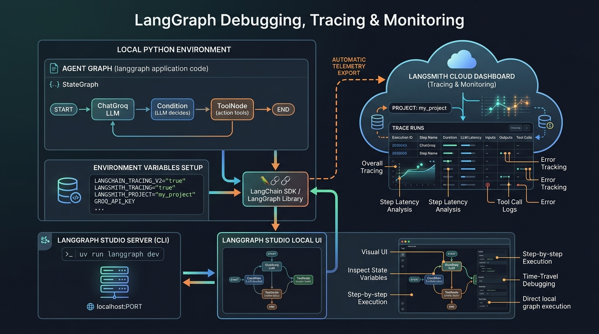

# 🚀 LangGraph Debugging, Tracing & Studio Monitoring Master Guide

A comprehensive guide and reference implementation for **Debugging**, **Tracing**, **Observability**, and **Live Studio Monitoring** of LangGraph agents using **LangSmith** and **LangGraph Studio**.

---

## 📐 Tracing & Monitoring Architecture Diagram



---

## 📂 Debugging Module Directory Structure

```text
langgraph/
├── assets/
│   └── langsmith_tracing_architecture.png  # Architecture Diagram
├── debugging/
│   ├── agent.py                            # Tool Agent Graph Factory & Server Target
│   ├── debugging.ipynb                     # LangSmith Tracing & Observability Notebook
│   └── langgraph.json                      # LangGraph Studio Server Config
├── .env                                    # API Keys & Tracing Configuration (Private)
├── .env.example                            # Environment Variables Template
├── pyproject.toml                          # Project Dependencies & UV Config
└── requirements.txt                        # Pip Requirements File
```

---

## 🧱 1. Environment Variable Setup (`.env`)

To send trace logs, execution duration, token metrics, and tool calls to a specific named project in LangSmith instead of the default bucket, configure both `LANGSMITH_*` and `LANGCHAIN_*` environment variables in your root `.env` file:

```env
GROQ_API_KEY="gsk_..."
TAVILY_API_KEY="tvly-..."
LANGSMITH_API_KEY="lsv2_pt_..."

# Enables LangSmith & LangChain Tracing
LANGSMITH_TRACING="true"
LANGSMITH_PROJECT="TracingProject"

LANGCHAIN_TRACING_V2="true"
LANGCHAIN_PROJECT="TracingProject"
LANGCHAIN_API_KEY="lsv2_pt_..."
```

> [!IMPORTANT]
> **Gotchas & Best Practices:**
> - **Spelling Typos:** Ensure the key is spelled **`LANGSMITH_PROJECT`** (not `LANGSMITH_PORJECT`). A typo causes LangSmith to ignore your project name and route all traces into `"default"`.
> - **Jupyter Kernel Caching:** `load_dotenv()` does **not** overwrite previously loaded environment variables in an active Jupyter Kernel session by default. Always pass `load_dotenv(override=True)` in notebooks.

---

## 🧱 2. Jupyter Notebook Observability (`debugging/debugging.ipynb`)

In Jupyter notebooks, load environment variables with `override=True` before instantiating the LLM or invoking graph nodes:

```python
import os
from dotenv import load_dotenv

# Force override cached environment variables in active Jupyter kernel
load_dotenv(override=True)

# Verify tracing environment variables
os.environ["LANGSMITH_TRACING"] = os.getenv("LANGSMITH_TRACING", "true")
os.environ["LANGSMITH_PROJECT"] = os.getenv("LANGSMITH_PROJECT", "TracingProject")
os.environ["LANGCHAIN_TRACING_V2"] = os.getenv("LANGCHAIN_TRACING_V2", "true")
os.environ["LANGCHAIN_PROJECT"] = os.getenv("LANGCHAIN_PROJECT", "TracingProject")
os.environ["LANGCHAIN_API_KEY"] = os.getenv("LANGSMITH_API_KEY")
```

---

## 🧱 3. Agent Graph Definition (`debugging/agent.py`)

The agent graph definition is structured as a factory function returning a compiled `StateGraph` object:

```python
from typing import Annotated
from typing_extensions import TypedDict
from langgraph.graph import StateGraph, START, END
from langgraph.graph.message import add_messages, BaseMessage
from langgraph.prebuilt import ToolNode, tools_condition
from langchain_core.tools import tool
from langchain_groq import ChatGroq
import os
from dotenv import load_dotenv

load_dotenv(override=True)

# Initialize LLM
llm = ChatGroq(model="qwen/qwen3.6-27b")

class State(TypedDict):
    messages: Annotated[list[BaseMessage], add_messages]

def make_tool_graph():
    """Graph factory returning compiled tool graph."""
    @tool
    def add(a: float, b: float):
        """Add two numbers."""
        return a + b

    tools = [add]
    llm_with_tools = llm.bind_tools(tools)

    def call_llm_model(state: State):
        return {"messages": [llm_with_tools.invoke(state['messages'])]}

    builder = StateGraph(State)
    builder.add_node("chatbot", call_llm_model)
    builder.add_node("tools", ToolNode(tools=tools))

    builder.add_edge(START, "chatbot")
    builder.add_conditional_edges("chatbot", tools_condition)
    builder.add_edge("tools", "chatbot")

    return builder.compile()

# Target variable exported for LangGraph CLI / Studio
tool_agent = make_tool_graph()
```

---

## 🧱 4. LangGraph Studio Server (`debugging/langgraph.json`)

LangGraph Studio provides an interactive local Web UI to visualize graph nodes, inspect state transitions in real time, and debug execution steps.

#### Configuration File (`debugging/langgraph.json`):
```json
{
  "dependencies": ["."],
  "graphs": {
    "tool_agent": "./agent.py:tool_agent"
  },
  "env": "../.env"
}
```

---

## 🧱 5. Execution & Server Commands

Navigate into the `debugging/` directory to run the server commands:

```cmd
cd debugging
```

### Run LangGraph Studio Server

#### Command Prompt (`cmd`):
```cmd
set PYTHONIOENCODING=utf-8 && uv run langgraph dev
```

#### PowerShell:
```powershell
$env:PYTHONIOENCODING="utf-8"; uv run langgraph dev
```

> [!TIP]
> **Windows `UnicodeEncodeError` Fix:**  
> `langgraph dev` outputs rich unicode symbols (e.g. 🏃‍♀️‍➡️). Setting `PYTHONIOENCODING=utf-8` prevents `UnicodeEncodeError: 'charmap' codec...` on Windows consoles.

---

### Command Reference Table

| Command | Description |
| :--- | :--- |
| `uv run langgraph dev` | Launches local LangGraph Studio server with hot reloading |
| `uv run langgraph dev --port 8000` | Launches Studio server on custom port 8000 |
| `uv run langgraph dev --no-browser` | Launches server without automatically opening browser |
| `uv run python agent.py` | Runs Python agent script directly |
