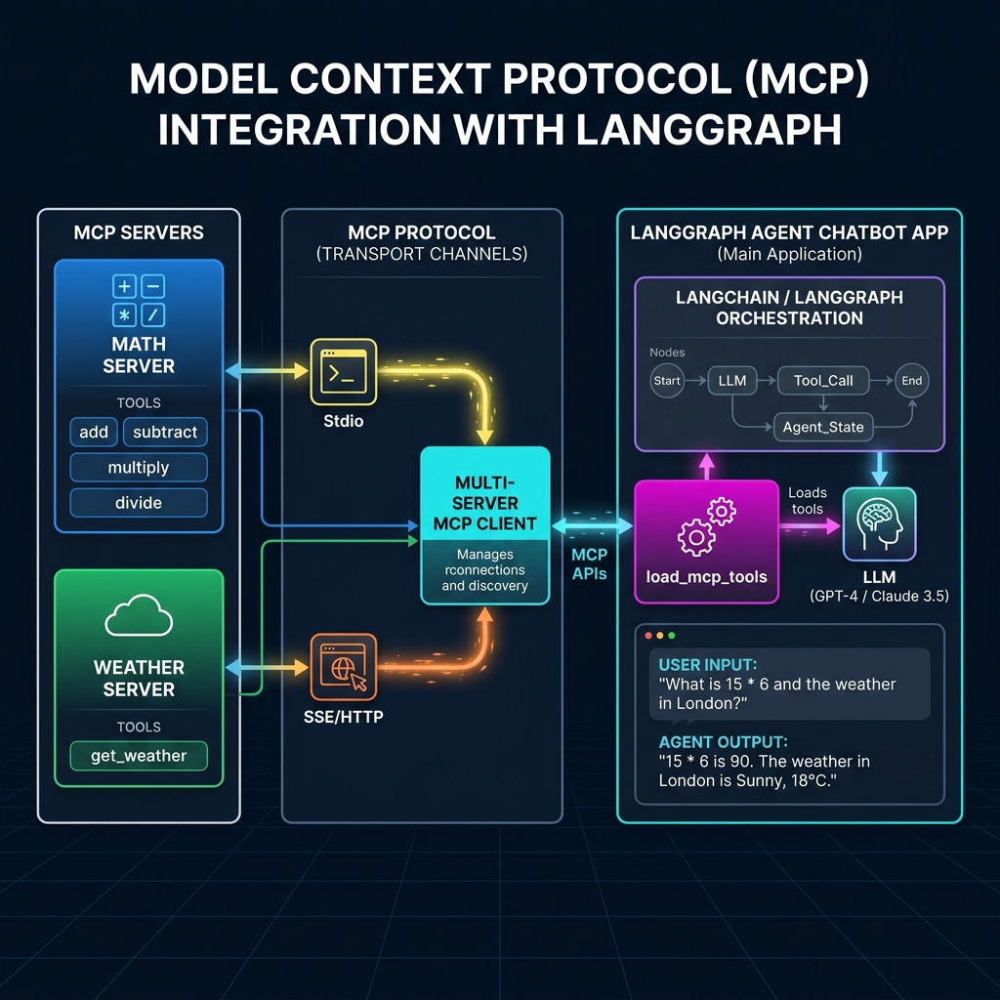

# Model Context Protocol (MCP) Integration with LangGraph

A modular implementation of the **Model Context Protocol (MCP)** built with **LangGraph**, **LangChain MCP Adapters (`langchain-mcp-adapters`)**, and **FastMCP**. This project demonstrates how a LangGraph agent dynamically connects to multiple independent MCP servers (Math and Weather tools) over standard transport channels (`stdio` and `sse` HTTP).

---

## 📐 Architecture & System Workflow Diagram



---

## 📦 Core Architecture Blocks

### Block 1: Understanding Model Context Protocol (MCP)

**Model Context Protocol (MCP)** is an open standard designed by Anthropic to unify how AI applications (clients/agents) connect with external tools, databases, and context servers. 

Instead of writing custom API wrappers for every tool, MCP provides a 1-to-1 client-server protocol where:
- **MCP Servers** expose tools, resources, and prompts.
- **MCP Clients** discover server tools dynamically and execute them on behalf of the agent.
- **LangGraph Agents** receive these tools transparently as native LangChain tools (`BaseTool`).

---

### Block 2: Transport Mechanisms (`stdio` vs `sse`)

MCP supports two primary transport protocol layers for client-server communication:

| Transport | Description | Ideal Use Case | Server Implementation |
| :--- | :--- | :--- | :--- |
| **Standard I/O (`stdio`)** | Spawns a child process and communicates via standard input/output streams (`stdin` / `stdout`). | Local server execution, CLI scripts, sandboxed tools. | `mcp.run(transport="stdio")` |
| **Server-Sent Events (`sse`)** | Asynchronous HTTP streaming transport running over a web server (Uvicorn / Starlette). | Remote web microservices, shared API endpoints. | `mcp.run(transport="sse")` |

---

### Block 3: Building MCP Server Tools (`FastMCP`)

MCP servers are defined using `FastMCP` from `mcp.server.fastmcp`.

#### A. Math MCP Tool Server (`mathserver.py`)
👉 **[mcp/mcp-tools/mathserver.py](file:///d:/PHP8.2/htdocs/learning/python-learning/langgraph/mcp/mcp-tools/mathserver.py)**

Exposes basic arithmetic functions (`add`, `subtract`, `multiply`, `divide`) over `stdio` transport:

```python
from mcp.server.fastmcp import FastMCP

mcp = FastMCP("Math")

@mcp.tool()
def add(a: int, b: int) -> int:
  """Add two numbers"""
  return a + b

@mcp.tool()
def subtract(a: int, b: int) -> int:
  """Subtract two numbers"""
  return a - b

@mcp.tool()
def multiply(a: int, b: int) -> int:
  """Multiply two numbers"""
  return a * b

@mcp.tool()
def divide(a: int, b: int) -> int:
  """Divide two numbers"""
  return a / b

if __name__ == "__main__":
  mcp.run(transport="stdio")
```

#### B. Weather MCP Tool Server (`weather.py`)
👉 **[mcp/mcp-tools/weather.py](file:///d:/PHP8.2/htdocs/learning/python-learning/langgraph/mcp/mcp-tools/weather.py)**

Exposes an asynchronous weather query tool supporting both `stdio` and `sse` HTTP streaming:

```python
import sys
from mcp.server.fastmcp import FastMCP

mcp = FastMCP("Weather")

@mcp.tool()
async def weather(city: str) -> str:
  """Get weather of a city"""
  return f"Weather in {city} is sunny"

if __name__ == "__main__":
  transport = "sse" if "--sse" in sys.argv else "stdio"
  mcp.run(transport=transport)
```

---

### Block 4: Multi-Server MCP Client & LangGraph Integration

👉 **[mcp/mcp-client/client.py](file:///d:/PHP8.2/htdocs/learning/python-learning/langgraph/mcp/mcp-client/client.py)**

The `MultiServerMCPClient` connects to multiple MCP server instances simultaneously, fetches their tool definitions, and attaches them to a LangGraph ReAct agent.

```python
import asyncio
import os
import sys
from dotenv import load_dotenv
from langchain_groq import ChatGroq
from langchain_mcp_adapters.client import MultiServerMCPClient
from langgraph.prebuilt import create_react_agent

load_dotenv()

# Resolve absolute paths to tool scripts
math_server_path = os.path.abspath(
    os.path.join(os.path.dirname(__file__), "../mcp-tools/mathserver.py")
)
weather_server_path = os.path.abspath(
    os.path.join(os.path.dirname(__file__), "../mcp-tools/weather.py")
)


async def main():
  # Initialize multi-server client connecting to Math & Weather tools via stdio
  client = MultiServerMCPClient({
      "math": {
          "command": sys.executable,
          "args": [math_server_path],
          "transport": "stdio",
      },
      "weather": {
          "command": sys.executable,
          "args": [weather_server_path],
          "transport": "stdio",
      },
  })

  # Dynamically load tools from all connected MCP servers
  tools = await client.get_tools()

  # Initialize ChatGroq LLM & LangGraph ReAct Agent
  model = ChatGroq(model="llama-3.3-70b-versatile")
  agent = create_react_agent(model, tools)

  # Execute agent invocation
  weather_res = await agent.ainvoke({
      "messages": [{"role": "user", "content": "what is the weather in New Delhi?"}]
  })
  print("Weather Response:\n", weather_res["messages"][-1].content)

  math_res = await agent.ainvoke(
      {"messages": [{"role": "user", "content": "what is 2 + 2?"}]}
  )
  print("Math Response:\n", math_res["messages"][-1].content)


if __name__ == "__main__":
  asyncio.run(main())
```

---

### Block 5: Execution & Virtual Environment Setup

When running python scripts in this repository, always run via **`uv`** to ensure dependencies inside `.venv` (`langchain-mcp-adapters`, `mcp`, `langchain-groq`) are correctly loaded:

#### Execute Client Script:
```powershell
uv run python .\mcp\mcp-client\client.py
```
